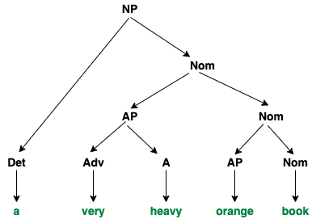

# Otomata W11

## Cocke–Younger–Kasami (CYK) Algorithm

CYK adalah algoritma yang digunakan untuk menyelesaikan *membership problem* menggunakan pendekatan **dynamic programming**. Algoritma ini membutuhkan grammar dalam bentuk **Chomsky Normal Form (CNF)**, yang dibentuk dari *context-free grammar*. Pembatasan ke CNF memungkinkan setiap masalah dibagi menjadi hanya dua submasalah — membatasi kompleksitas waktu.

---

## Cara Kerja CYK Algorithm

Untuk string dengan panjang **N**, buat tabel berukuran `N x N`. Setiap sel `T[i, j]` berisi **himpunan konstituen** yang dapat menghasilkan substring dari posisi `i` hingga `j`.

Algoritma bekerja dari bawah ke atas (*bottom-up*):

|     | 1   | 2   | 3   | 4   | 5   |
|-----|-----|-----|-----|-----|-----|
| 1   | 1,1 | 1,2 | 1,3 | 1,4 | 1,5 |
| 2   |     | 2,2 | 2,3 | 2,4 | 2,5 |
| 3   |     |     | 3,3 | 3,4 | 3,5 |
| 4   |     |     |     | 4,4 | 4,5 |
| 5   |     |     |     |     | 5,5 |

- `T[i, j]`: `i` adalah indeks awal, `j` adalah indeks akhir.
- Jika substring dari `i` ke `j` dapat dihasilkan dari non-terminal `K`, maka `K` ditambahkan ke `T[i, j]`.
- Untuk substring lebih panjang, algoritma memeriksa kemungkinan partisi dan aturan `A → B C`.

> **String diterima oleh grammar jika simbol awal (`S`) ada dalam `T[1, N]`.**

---

## Contoh Grammar dalam Chomsky Normal Form (CNF)

Grammar G:

NP   → Det | Nom
Nom  → AP | Nom 
AP   → Adv | A 
Det  → a | an
Adv  → very | extremely
AP   → heavy | orange | tall
A    → heavy | orange | tall | muscular
Nom  → book | orange | man

Misal terdapat string "a very heavy orange book" apakah bisa dinyatakan dalam grammar tersebut.

String: **"a very heavy orange book"**

---

### Representasi Tabel DP

|         | a   | very | heavy      | orange           | book    |
|---------|-----|------|------------|------------------|---------|
| a       | Det |      |            | NP               | NP      |
| very    |     | Adv  | AP         | Nom              | Nom     |
| heavy   |     |      | A, AP      | Nom              | Nom     |
| orange  |     |      |            | Nom, A, AP       | Nom     |
| book    |     |      |            |                  | Nom     |

---

### Penjelasan Pengisian Tabel

- `T[1,1] = {Det}` karena `Det → a`
- `T[2,2] = {Adv}` karena `Adv → very`
- `T[3,3] = {A, AP}` karena `A → heavy`, `AP → heavy`
- `T[2,3] = {AP}` karena `AP → Adv A`
- `T[4,4] = {Nom, A, AP}` karena `Nom → orange`, `A → orange`, `AP → orange`
- `T[3,4] = {Nom}` karena `Nom → AP Nom`
- `T[2,4] = {Nom}` karena `Nom → AP Nom`
- `T[1,4] = {NP}` karena `NP → Det Nom`
- `T[5,5] = {Nom}` karena `Nom → book`
- `T[4,5] = {Nom}` karena `Nom → AP Nom`
- `T[3,5] = {Nom}` karena `Nom → AP Nom`
- `T[2,5] = {Nom}` karena `Nom → AP Nom`
- `T[1,5] = {NP}` karena `NP → Det Nom`

> Karena `NP` (simbol awal) ada di `T[1,5]`, maka string **diterima oleh grammar**.

### Ilustrasi dalam bentuk tree
Penyelesaian juga dapat diilustrasikan dalam bentuk tree sebagai berikut:
